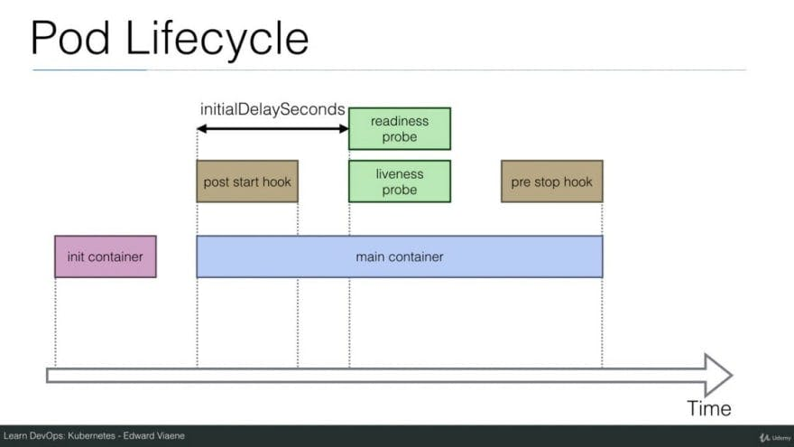

+++
title = "Graceful Shutdown com PHP - Evitando data corruption"
slug = "graceful-shutdown-com-php-evitando-data-corruption"
author = "leocarmo"
date = "2021-05-10T19:24:26-03:00"
tags = ["php", "kubernetes", "pcntl"]
description = "Quando trabalhamos com processos críticos, seja via script em background ou via o fluxo transacional de APIs, temos algo muito importante para considerar: a possibilidade de interromper um processamento antes que ele termine, causando uma corrupção de dados (data corruption)."
cover = "/graceful-shutdown-com-php-evitando-data-corruption/images/graceful-shutdown.png"
+++

Quando trabalhamos com processos críticos, seja via script em background ou via o fluxo transacional de APIs, temos algo muito importante para considerar: **a possibilidade de interromper um processamento antes que ele termine, causando uma corrupção de dados (data corruption)**.

---

### Certo, mas o que isso significa e quais os impactos?

Vamos pensar em um fluxo que conhecemos muito bem hoje: as transações em bancos de dados relacionais. Usamos isso quando precisamos garantir que dados sejam inseridos/alterados/deletados em conjunto, garantindo assim a consistência dos mesmos. Ou seja, se em algum momento da transação algo der errado, realizamos o rollback, caso contrario, o commit da transação.

Com isso em mente, vamos mudar o contexto para um script em background que precisa realizar uma determinada tarefa com vários steps, normalmente um `while(true)` que assina um tópico/fila e fica processando sem tempo definido. Mais conhecido como "moedor de carne" rs…

Agora vamos pensar que cada loop demore cerca de 1s para realizar a tarefa e este script está em um container que receberá uma nova versão de código, assim, o mesmo precisará ser destruído e um novo assumirá.

No momento do deploy, o container será forçado a desligar e poderá estar no meio de um processamento, que leva cerca de 1s, lembra?

> O que pode acontecer com o que estava sendo feito no loop? Tente pensar antes de continuar!


---

Resposta: não sabemos! Ele pode ter forçado o desligamento em qualquer step. Pode ter sido no meio de uma transação de banco onde a mesma vai ficar presa até expirar, seja no envio de dados incompletos para outros serviços, geração de eventos "fantasmas", e por aí vai…

Evitar essa corrupção de dados é uma tarefa bem simples, basta entender esse fluxo de desligamento e terminar de fazer o que estava sendo feito antes de realmente desligar o serviço. Lembrando que isso também vale para APIs, precisamos terminar uma requisição em andamento antes de desligar o serviço.

---

### Processo de shutdown no Kubernetes

Basicamente podemos resumir em dois momentos, primeiro um aviso de desligamento, conhecido como `SIGTERM`, e o desligamento forçado, conhecido como `SIGKILL`, que será enviado caso o container não tenha terminado após o aviso.

> Caso queira entender um pouco mais sobre estes sinais, [veja este artigo](https://major.io/2010/03/18/sigterm-vs-sigkill/) que explica bem a diferença entre cada um deles.



Podemos ver cada estágio do lifecycle do Pod nesta imagem, onde nosso foco está na última caixinha da direita, onde temos o `pre stop hook`, que emite o sinal de `SIGTERM` e aguarda o desligamento do container. Veja o [video completo](https://www.youtube.com/watch?v=lnAwa8IFaLU) deste diagrama para mais detalhes.

> Para entender cada detalhe deste processo, você pode acessar a [documentação oficial](https://kubernetes.io/docs/concepts/workloads/pods/pod-lifecycle/#pod-termination). Caso você não tenha sua arquitetura rodando com essa tecnologia não se preocupe, o processo é similar e existem vários artigos que você pode consultar, o importante é que você entenda o fluxo de shutdown e aplique conforme sua realidade.

Sendo assim, o que devemos fazer é "escutar" esse aviso de desligamento, terminar o que estamos fazendo e desligar o container com a segurança de que nenhum processo estava em andamento, evitando a corrupção dos dados.


---

### Com tudo isso em mente, vamos focar na solução!

Começando pelo web server, utilizando o `php-fpm` esta tarefa é simples. Temos um parâmetro para configurar quanto tempo os `child processes` possuem para finalizar o processo atual antes de desligarem:

```
process_control_timeout = 10s
```


Conforme a [documentação oficial](https://www.php.net/manual/en/install.fpm.configuration.php#process-control-timeout), o valor padrão deste parâmetro é zero, com isso, assim que os `child processes` recebem o sinal eles encerram, o que pode ser bastante danoso.

> É importante lembrar que no Kubernetes, depois do alerta, caso o processo não tenha sido encerrado, ele é forçado a encerrar, então o valor deste parâmetro precisa dar match com o tempo máximo de uma requisição processada com sucesso e o tempo de espera do Kubernetes até forçar o desligamento.

---

### Scripts de processamento em background, via PHP CLI

Agora vamos falar dos scripts que trabalham em `while(true)` e não possuem nada para avisar o loop de que um sinal de desligamento foi enviado.

Para resolver este problema, temos uma extensão para o PHP chamada de `pcntl` que consegue registrar *handlers* para sinais enviados ao processo, ou seja, conseguimos "escutar" quando o Kubernetes nos avisar que devemos encerrar.

> **Importante**: esta funcionalidade não deve ser habilitada em contextos de web server, exemplo do php-fpm, pois pode ocasionar em comportamentos inesperados. O seu uso correto é para scripts utilizando o PHP CLI.

Para facilitar a implementação e utilização desta extensão, criei uma lib bem simples que faz toda essa mágica acontecer:

[https://github.com/leocarmo/graceful-shutdown-php](https://github.com/leocarmo/graceful-shutdown-php)

Com ela, você consegue garantir que nenhum dado será corrompido caso o desligamento seja necessário e, caso seja necessário, registrar um callback para ser executado antes do desligamento.

Se código ficará parecido com este:

```php
use LeoCarmo\GracefulShutdown\GracefulShutdown;

$shutdown = new GracefulShutdown();

while (! $shutdown->signalReceived()) {

    echo 'Start long task...' . PHP_EOL;
    sleep(sleep(5)); // --> when a signal is sent, sleep returns the number of seconds left
    echo 'End long task...' . PHP_EOL;

}

echo 'Graceful shutdown!';
```

Por ora é isso, espero poder te ajudar a construir aplicações mais consistentes e evitar a corrupção de dados, tanto no fluxo de requisições, quanto via scripts. (:
