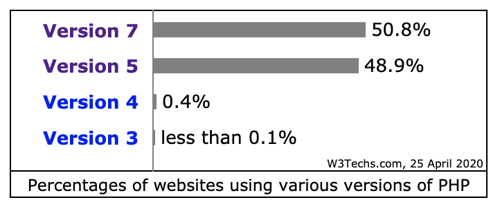
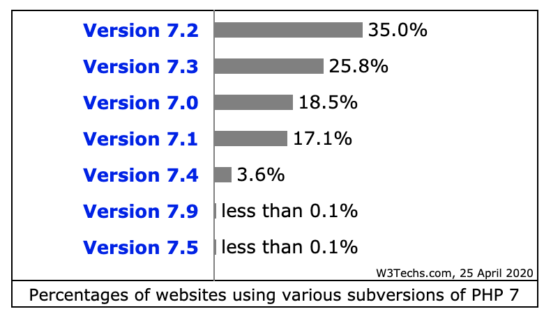
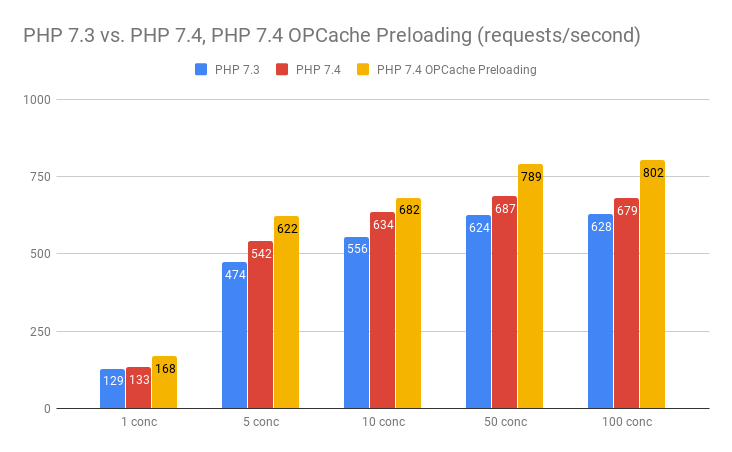
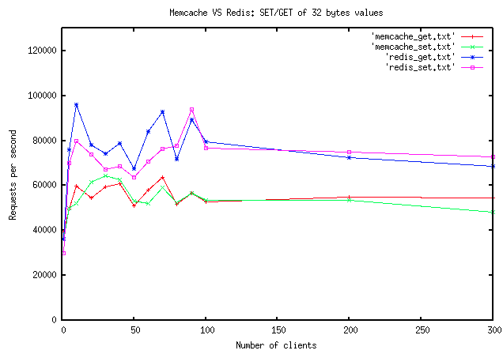
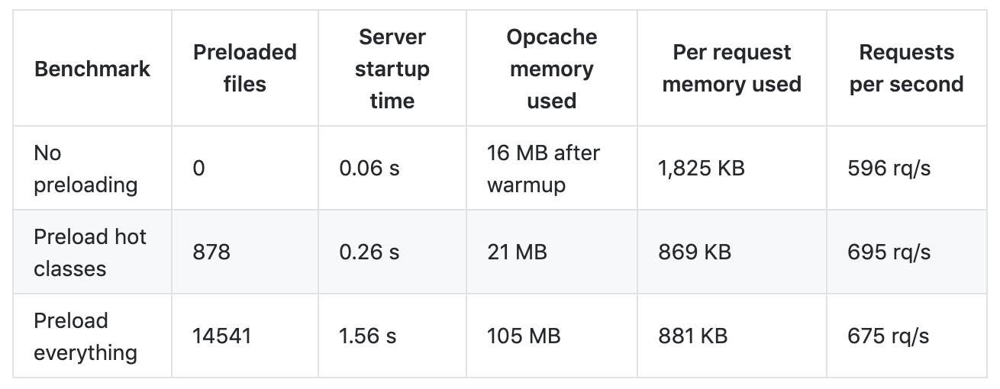
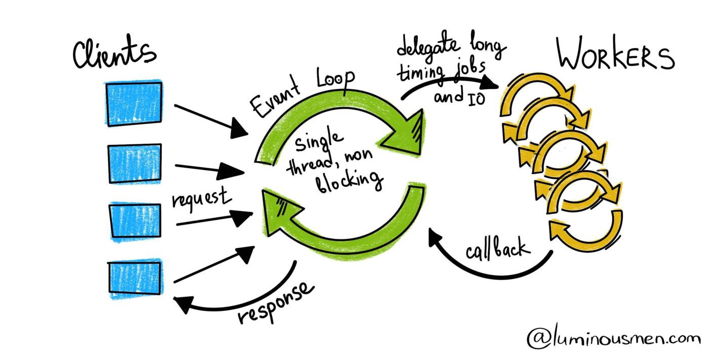
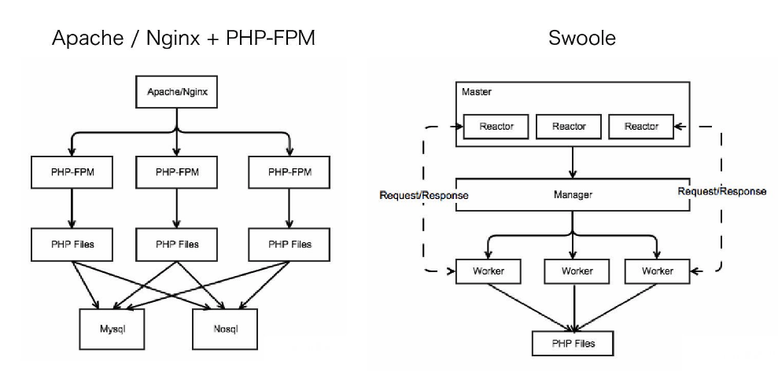

+++
title = "Guia: Alta performance com PHP — Suas aplicações backend no próximo nível"
author = "leocarmo"
date = "2020-05-12T19:30:00-03:00"
tags = ["php", "swoole", "php-fpm", "opcache"]
description = "O PHP é muito poderoso, só depende de nós utilizá-lo da melhor forma. Meu objetivo com esta publicação é ajudar nesta jornada."
cover = "/guia-alta-performance-com-php-suas-aplicações-backend-no-próximo-nível/images/foguete.jpeg"
+++

Muitas pessoas dizem que alta performance e PHP não existem na mesma frase. Se você ainda pensa assim, vou te provar o contrário.

O PHP é muito poderoso, só depende de nós utilizá-lo da melhor forma. Meu objetivo com esta publicação é ajudar nesta jornada.

Todo mundo já sabe que grandes empresas usam PHP, mas esse não é o argumento mais forte ao se falar sobre este assunto.

Argumentos fortes são: aplicações poderosas, resoluções de problemas de forma inteligente e implementações diferentes do comum. E vamos falar muito sobre isso aqui!

Não vou abordar apenas tópicos voltados ao código, a ideia é falar sobre o ambiente como um todo: arquitetura, implementações e, claro, código.

Um ponto importante é que vamos focar exclusivamente em aplicações backend, funcionando sem renderização de views. Pois, caso sua aplicação seja full stack, muitas outras otimizações ainda precisam ser feitas.

Começaremos do básico e vamos aprofundando em assuntos mais complexos aos poucos. Alguns tópicos irei apenas trazer ideias iniciais, e depois te direcionar para outras publicações onde você possa estudar e entender mais sobre eles.

Quero te guiar pelas melhores práticas para conseguir, de fato, elevar o nível das suas aplicações de forma fácil e objetiva. Então bora lá!

#### Tópicos
1. [Atualize TUDO, sempre!](#1-atualize-tudo-sempre)
2. [Refatore sua infraestrutura](#2-refatore-sua-infraestrutura)
3. [Boas práticas e padrões de projeto](#3-boas-práticas-e-padrões-de-projeto)
4. [Frameworks](#4-frameworks)
5. [Otimizando o PHP-FPM](#5-otimizando-o-php-fpm)
6. [O poder do OPcache](#6-o-poder-do-opcache)
7. [Utilize cache em memória](#7-utilize-cache-em-memória)
8. [Conexões persistentes](#8-conexões-persistentes)
9. [Funções nativas](#9-funções-nativas)
10. [Preloading](#10-preloading)
11. [Generators](#11-generators)
12. [Código assíncrono](#12-código-assíncrono)
13. [Non-blocking I/O com PHP](#13-non-blocking-io-com-php)

---

## 1. Atualize TUDO, sempre!

É, parece bem óbvio. Mas quando foi a última vez que você atualizou as dependências do seu projeto? E a versão do PHP?

De acordo com a  [W3Techs](https://w3techs.com/technologies/details/pl-php), o PHP é utilizado por 78.2% de todos os websites, considerando sua linguagem de backend.

> WOOW THAT’S AWESOME!

Nem tanto… Essa é uma das razões de muita gente não gostar de PHP e falar coisas bem ruins (digamos que, nesse caso, não estão errados).

A versão 7 é utilizada por apenas 50.8% desses websites. Ou seja, a outra metade está utilizando uma versão terrível…



E ainda fica pior, mesmo na versão 7, menos de 30% estão utilizando uma versão com suporte ativo, analisando o dia que estou escrevendo. E apenas 3.6% estão na ultima versão estável disponível (7.4), o que é péssimo!



Mas o que isso tem a ver com performance? TUDO! Alem de ficar cada vez mais performático, muitas atualizações de segurança são lançadas, o que já seria suficiente para você atualizar seu PHP.

> Lembre-se: alem do PHP, é preciso atualizar suas dependências do composer e suas extensões!

Para ver um pouco mais sobre testes de performance, acesse [este link](https://kinsta.com/blog/php-benchmarks/).


E o  [8.0 vem aí](https://stitcher.io/blog/new-in-php-8) com novidades e, claro, mais  [melhorias em performance](https://thephp.website/br/edicao/php-8-jit/). Aqui falamos apenas do PHP, mas temos extensões e bibliotecas também, então: atualize TUDO, sempre!

---

## 2. Refatore sua infraestrutura

Mais uma coisa óbvia? Talvez. Mas sabemos que muitos sistemas rodam tudo no mesmo servidor: banco de dados, aplicação, webserver, cache, sistema de arquivos…

Algumas pessoas justificam isso dizendo que é para redução de custos. De início tudo bem, mas se seu sistema começar a crescer, essa conta não vai ficar barata. Dividir processamento entre diversos processos vai degradar a performance como um todo, mesmo com muito recurso disponível.

Dividir os serviços que você utiliza, permite um gerenciamento por demanda dos recursos. Ou seja, caso seu banco precise de mais memória, apenas ele sofre um upgrade pontual, sem precisar ter uma máquina gigante com tudo dentro.

Essa refatoração com certeza vai melhorar a performance do seu sistema como um todo e, dependendo do nível de tráfego, também vai reduzir seus custos e complexidade de gerenciamento.

Alguns serviços e dicas que podem ajudar:

- Nginx no lugar do Apache ([Por quê?](https://serverguy.com/comparison/apache-vs-nginx/) / [Como?](https://www.nginx.com/blog/tuning-nginx/))
- Utilize [Docker](https://dzone.com/articles/top-10-benefits-of-using-docker)
-  [Elastic container service](https://docs.aws.amazon.com/AmazonECS/latest/developerguide/Welcome.html)
-  [Relational database service](https://aws.amazon.com/rds/?nc1=h_ls)
-  [Cloud object storage](https://aws.amazon.com/s3/?nc1=h_ls)

> Você pode usar qualquer cloud provider, os links são para que você conheça mais sobre este tipo de serviço gerenciado.

Esse é o básico para que você comece a refatorar sua infraestrutura. Existem muitos outros serviços interessantes que também podem ajudar, vamos falar sobre alguns deles em outros tópicos.

---

## 3. Boas práticas e padrões de projeto

Não vou abordar cada padrão de projeto aqui, a ideia é ressaltar a importância de levar tudo isso muito a sério.

Por mais que sempre lemos essas palavras por aí, estamos realmente colocando isso em prática? Dentre todos os benefícios, performance com certeza está entre eles.

Podemos destacar a [early return pattern](https://szymonkrajewski.pl/why-should-you-return-early/), que influencia diretamente a performance das aplicações quando trabalhamos com altas volumetrias. Quanto mais rápido conseguirmos responder uma requisição, mais rápido estaremos prontos para a próxima!

Utilizar padrões de projeto e boas práticas é trazer soluções inteligentes e performáticas para suas aplicações, então, sempre que fizer sentido, utilize!

> Mas atenção, [KISS](https://en.wikipedia.org/wiki/KISS_principle)! Padrões não são soluções para tudo, saiba utilizar de forma inteligente e não como bala de prata.

Alguns materiais para se aprofundar no assunto:
-  [Design patterns](https://sourcemaking.com/design_patterns)
-  [SOLID](https://scotch.io/bar-talk/s-o-l-i-d-the-first-five-principles-of-object-oriented-design)
-  [PHP Standards Recommendations](https://www.php-fig.org/psr/)
-  [Don’t repeat yourself](https://en.wikipedia.org/wiki/Don%27t_repeat_yourself)
-  [Circuit Breaker Pattern](https://github.com/leocarmo/circuit-breaker-php)

---

## 4. Frameworks

Este sempre acaba sendo um assunto polêmico. Então, vamos tirar um pouco o foco apenas da perfomance e pensar em outros tópicos importantes para este assunto.

A escolha de um framework tem que levar outros aspectos em consideração, entre eles gostaria de destacar alguns:

- A equipe está confortável em trabalhar com ele?
- A comunidade é ativa?
- Ele é atualizado com qual frequência?
- A documentação é bem estruturada?
- Já pensou em usar um micro-framework?

Estes são pontos que podem influenciar o futuro da sua aplicação, pois, se não for atualizado com frequência, sua performance pode ser degradada. Se a comunidade não estiver ativa o suficiente, o mesmo pode acontecer.

Então, ao escolher, leve em consideração outros aspectos importantes.

---

## 5. Otimizando o PHP-FPM

Iniciando os tópicos um pouco mais avançados, vamos falar sobre o [php-fpm](https://www.php.net/manual/en/install.fpm.php). Aqui, vamos considerar que você já utiliza o Nginx com o php-fpm e que já [saiba como ele funciona](https://www.inmotionhosting.com/support/website/php-fpm-the-future-of-php-handling/), pelo menos de forma básica. Se não utiliza, a primeira recomendação é mudar para essa combinação extremamente poderosa.

As configurações que vamos abordar aqui, leva em consideração que seu sistema tem um grande volume de requisições.

Vamos focar aqui na configuração dos processos que serão abertos e gerenciados pelo fpm. Com isso, a melhor forma de gerenciar estes processos em alta volumetria é de forma estática. Assim, o fpm não vai precisar se preocupar em aumentar ou diminuir cada um deles.

Outro ponto importante é a quantidade de requisições que cada processo irá processar antes de ser renovado. Temos que pensar no equilíbrio, pois, enquanto um número muito alto pode causar um [memory leak](https://medium.com/@FreeDev/tenha-cuidado-com-o-memory-leak-b171622b4c6b), um número muito baixo pode fazer com que, a todo momento, o fpm tenha que lidar com o start de um novo processo. Então saiba quanto cada uma das suas requisições utiliza de memória para ajustar essa configuração, para isso faça [profilling](https://stackify.com/php-profiling-find-slow-code/)!

Sendo assim, um exemplo de configuração seria:

```
[api]
pm = static
pm.max_children = 16
pm.max_requests = 10000
``` 

Com workers estáticos já teremos uma grande diferença. Claro, existem diversas outras configurações, então para saber um pouco mais, aqui tem [um artigo](https://geekflare.com/php-fpm-optimization/) abordando mais sobre este assunto.

---

## 6. O poder do OPcache

Esta é uma extensão muito poderosa para o PHP, se você não utiliza, pare tudo e implemente o quanto antes! Para uma rápida introdução, o que diz a [documentação](https://www.php.net/manual/en/book.opcache.php):

> OPcache improves PHP performance by storing precompiled script bytecode in shared memory, thereby removing the need for PHP to load and parse scripts on each request.

Com isso, já da pra sentir o poder que ele pode dar para suas aplicações. Todo o sistema será compilado apenas uma vez e estará disponível em memória para as próximas requisições. Show!

Um benchmark para mostrar o poder do OPcache:



> [Fonte da imagem](https://www.ibexa.co/blog/benchmarking-php-7.3-vs-7.4-with-symfony-4.4-trouble-with-opcache-preloading)

Começar a utilizar é muito fácil, basta instalar, configurar e pronto! Porém, como aponta a documentação, todos os scripts vão para memória. Isso significa que, caso não utilize container, ao atualizar seu projeto, é preciso dar um reload no seu processo do fpm para que ele limpe os scripts antigos e recompile os novos.

Vou deixar aqui uma configuração bem interessante para iniciar:

```
[opcache]
opcache.enable=1
opcache.memory_consumption=128
opcache.max_accelerated_files=4000
opcache.validate_timestamps=0
opcache.interned_strings_buffer=12
opcache.use_cwd=0
``` 

Existem  [diversas configurações disponíveis](https://www.php.net/manual/en/opcache.configuration.php), basta dar uma olhada na documentação e configurar conforme fizer sentido para sua aplicação. Para saber mais sobre o OPcache, existem muitos materiais bacanas disponíveis, [aqui tem um](https://www.cloudways.com/blog/integrate-php-opcache/).

---

## 7. Utilize cache em memória

"Cachear" sua aplicação de forma inteligente pode ser uma das coisas mais importantes para se obter um ganho expressivo em performance e redução de custos.

Sabe quando você precisa utilizar um mesmo código em dois lugares diferentes e, para isso, você cria um método que possui esse mesmo "trabalho" a ser feito? Utilizar cache é basicamente armazenar um trabalho já feito para ser reaproveitado.

Os ganhos? Performance claro, se aquele trabalho demorava 1s, usando cache pode chegar a demorar 5ms. Sim, é muito poderoso. E isso nos leva a redução de custos, na aplicação e no banco de dados, pois a ideia é reduzir as chamadas ao banco também.

Não existe uma estratégia pronta para isso, quem define é você. Mas o direcionamento do pensamento é: posso reutilizar um trabalho já feito para as próximas requisições? Um exemplo prático e simples: um blog possui uma sessão de "mais visualizados", para isso, é preciso pegar todas as publicações e ordena-las pelo número de views. A cada requisição você realmente precisa fazer isso? Ou pode armazenar esse trabalho durante um tempo? Então utilize cache por 30m por exemplo. Pode confiar, os ganhos são infinitos!

Falando de cache em alta performance, eu focaria em duas opções: [Redis](https://redis.io/) ou [Memcached](https://memcached.org/). Existem outras alternativas, mas eu iria com um deles, e entre os dois: Redis. Além de mais performático, ele possui diversas [outras vantagens](https://aws.amazon.com/elasticache/redis-vs-memcached/).



> [Fonte do benchmark](http://oldblog.antirez.com/post/redis-memcached-benchmark.html)

**Bônus:** utilizando [essa extensão](https://github.com/phpredis/phpredis) do Redis para PHP, você tem ainda mais poder de otimização e assume o controle total do Redis de forma fácil e eficiente. É possível, por exemplo, armazenar suas sessões do PHP no Redis, ou seja, não precisa mais se preocupar com a performance do storage da aplicação, sua aplicação vai voar! :)

---

## 8. Conexões persistentes

Esse é um assunto que vi sendo abordado poucas vezes, quando o assunto é performance. Conexões persistentes são muito poderosas para trabalhar em alta volumetria.

Na verdade, ouvimos falar sobre [conexões http persistentes](https://en.wikipedia.org/wiki/HTTP_persistent_connection), mas elas não são as únicas que sua aplicação precisa lidar. Temos também ao banco de dados e ao Redis, por exemplo.

Vou utilizar a do banco de dados como exemplo. Lembra do php-fpm que gerencia seus processos? Certo! Vamos pensar que ele processou as 10 mil requisições que configuramos e que todas as requisições precisaram ir ao banco de dados duas vezes. Com uma conexão tradicional, apenas uma seria aberta para realizar as duas queries, show! Mas pensando em um ambiente macro, nessas 10 mil requisições teríamos que fazer isso 10 mil vezes!

O recurso computacional exigido nesse processo, tanto da aplicação, quanto do banco de dados é de se levar em consideração. Com isso, podemos utilizar as conexões persistentes e reaproveitar uma conexão já aberta para esse processo e com certeza ter um ganho expressivo em recursos e performance, claro.

E para utilizar é bem simples, basta passar o parâmetro de configuração `PDO::ATTR_PERSISTENT` ao driver de conexão como `true`. Para saber um pouco mais vale conferir a [documentação oficial](https://www.php.net/manual/en/pdo.connections.php).

Caso queira ler um pouco mais, vou deixar um [link interessante aqui](https://www.valinv.com/dev/mysql-mysql-persistent-connections-in-php) sobre conexões persistentes ao banco de dados.

Ao utilizar o Redis com [PhpRedis](https://github.com/phpredis/phpredis#pconnect-popen) (o mais recomendado), basta mudar a forma de conectar para `$redis->pconnect()` , simples assim!

---

## 9. Funções nativas

Bom, todos sabemos que [elas existem](https://www.php.net/manual/en/indexes.functions.php). Mas realmente usamos? Aqui tem um [top 100](https://www.exakat.io/top-100-php-functions/) das funções nativas mais utilizadas em projetos open source. Não quero entrar no mérito se foram bem utilizadas ou não, mas é um ranking interessante para analisar quais são mais utilizadas e dar um primeiro passo.

Hoje em dia, eu quase nunca utilizo loops na mão. Isso porque consigo resolver quase tudo com funções nativas, que são mais performáticas. Elas também ajudam bastante quando pensamos em manutenção de código, pois facilitam o entendimento na hora de ler.

Um teste rápido, qual você consegue entender mais rápido?

```php
// Job
function cube($number) {
    return ($number * $number * $number);
}

// Without native
$cubes = [];
foreach($numbers as $number) {
    $cubes[] = cube($number);
}

// With native
$cubes = array_map('cube', $numbers);
```

Fiz um [benchmark rápido](https://gist.github.com/leocarmo/4a1320da1b61523c0c8d00ef2a3524e3) com esse código, e utilizando `array_map` consegui um resultado quase 15% mais performático, testando um array com 1.000.000 elementos 1.000 vezes.

Uma outra solução que gosto bastante é utilizar [Laravel Collections](https://laravel.com/docs/7.x/collections). O código fica mais limpo e legível, além de utilizar diversas funções nativas "por baixo".

---

## 10. Preloading

O PHP 7.4 veio com uma novidade bem bacana, o preloading do [OPcache](https://leonardocarmo.medium.com/guia-alta-performance-com-php-suas-aplica%C3%A7%C3%B5es-backend-no-pr%C3%B3ximo-n%C3%ADvel-c0a3ca9aed10#9c93), que falamos ali em cima. Resolvi falar sobre isso separadamente para entrar um pouco mais no detalhe, e por serem coisas diferentes mas complementares.

**E qual a diferença, na prática, em usar esse preloading?**

Como já sabemos, a principal característica do OPcache é armazenar os arquivos já compilados ("opcodes") em memória para serem reutilizados. Certo, já falamos sobre isso. Mas ele faz isso sem relacionar tudo que foi compilado e não consegue resolver dependências entre as classes quando chegar uma requisição, ou seja, já está tudo em memória, mas quando uma classe herda outra, essa relação precisa ser vinculada.

Sendo assim, a cada requisição, ele precisa vincular as dependências entre as classes em tempo de execução. Lembra do ponto em reaproveitar trabalho? Bom, se podemos reaproveitar, podemos ganhar performance!

Para implementar esse preloading, alguns frameworks já trazem alguma solução pronta, como por exemplo o [Symfony](https://symfony.com/blog/new-in-symfony-4-4-preloading-symfony-applications-in-php-7-4).

Mas nada que não possa ser feito em outro framework. Basicamente é apontar um arquivo de preload no seu `php.ini` dentro das configurações do OPcache.

```
opcache.preload=/path/to/project/preload.php
```

E dentro deste arquivo, carregar todo o seu projeto.

```
$files = require 'vendor/composer/autoload_classmap.php';

foreach (array_unique($files) as $file) {
    opcache_compile_file($file);
}
```

Bom, neste exemplo iríamos carregar o projeto todo. Para iniciar não é ruim, mas tendo em mente que é preciso melhorar.

Nosso projeto não utiliza TODOS os arquivos e TODAS classes que temos, então qual motivo de carregar tudo?

Aqui tem uma thread para se adicionar o preloading no composer de forma nativa, [mas tem um comentário](https://github.com/composer/composer/issues/7777#issuecomment-440268416) bem bacana sobre os ganhos de fazer um preloading apenas das classes mais utilizadas no projeto.



Com isso, da para ter uma ideia do custo/benefício de cada abordagem. Eu recomendo o preloading apenas das classes principais. Mas, você pode começar fazendo do projeto todo para ter um ganho inicial.

Até o momento, ainda não utilizei [esta lib](https://github.com/DarkGhostHunter/Preloader), mas achei bem interessante a ideia e pretendo utilizar. Quando fizer, coloco aqui os resultados.

[Aqui tem um artigo](https://stitcher.io/blog/preloading-in-php-74) bacana sobre esse assunto, onde você pode se aprofundar um pouco mais.

**Bônus:** como falamos sobre o composer, não vou abrir uma sessão exclusiva pra isso, acho que podemos resumir rapidamente o que precisa ser feito para otimizá-lo. Na [documentação oficial](https://getcomposer.org/doc/articles/autoloader-optimization.md) tem os detalhes, então para instalar seu projeto em produção utilize estas instruções:

```sh
/usr/bin/composer install --no-dev -o -a
```

---

## 11. Generators

Essa também é uma ferramenta bem poderosa que temos, não apenas no PHP, mas em todo o ecossistema de desenvolvimento. Na [documentação oficial](https://www.php.net/manual/en/language.generators.overview.php), temos um detalhamento melhor sobre isso, mas podemos resumir em dois itens:

- É uma forma simples de escrever [iterators](https://www.php.net/manual/en/language.oop5.iterations.php)
- É possível iterar dados sem precisar construir um array em memória

Com isso em mente, e ainda analisando a documentação oficial, temos um exemplo de implementação de um `range()` que vou fazer uma alteração para ilustrar melhor a ideia:

```php
// range nativo
foreach (range(1, 1_000_000) as $number) {
    echo $number . PHP_EOL;
}

// range com generator
function xrange(int $start, int $end) {
    for ($i = $start; $i <= $end; $i++) {
        yield $i;
    }
}

foreach (xrange(1, 1_000_000) as $number) {
    echo $number . PHP_EOL;
}
```

Se você tentar rodar esse código, pode ser que você receba um: `Fatal error: Allowed memory size` (dependendo da sua configuração no `php.ini`).

Na implementação nativa do `range`, por ele tentar alocar em memória 1M de integers, você pode explodir seu script por falta de memória. O que no `xrange` não ocorre, pois ele alocou apenas 1. Sim, isso mesmo, apenas 1.

> **Que diferença hein?!**

Isso ocorre pois o retorno vai "passo a passo", retornando um generator para que o `foreach` o execute um a um. É uma prática bem comum utilizar essa técnica ao ler arquivos bem grandes.

Bom, acho que ja é possível entender os ganhos até aqui de se utilizar essa técnica. Foi pensando nisso que o Laravel implementou as [LazyCollections](https://laravel.com/docs/master/collections#lazy-collections), por exemplo.

> Mas os generators vão além disso. E é aqui que tudo começa a ficar bem mais interessante! Os generators abrem as portas para se trabalhar com corrotinas utilizando PHP. Sim, muito maneiro! E isso já existe desde a versão 5.5.

Aqui o assunto começa a ficar mais complexo, e tudo bem, não é fácil entender tudo isso logo de cara... É uma forma diferente de manipular e interagir com o estado de uma aplicação, então, antes de avançar, recomendo que você entenda melhor este e outros termos que vamos começar a utilizar daqui pra frente, e como tudo isso se relaciona.

Para isso, vou deixar um roteiro de artigos aqui para você:

- [Introdução teórica a estes termos](https://www.treinaweb.com.br/blog/concorrencia-paralelismo-processos-threads-programacao-sincrona-e-assincrona/)
- [Entendendo mais sobre generators](https://thephp.website/br/edicao/voce-achou-que-sabia-sobre-generators/)
- [Corrotinas com generators](https://nikic.github.io/2012/12/22/Cooperative-multitasking-using-coroutines-in-PHP.html)

---

## 12. Código assíncrono

Bom, a partir daqui, podemos assumir que você já entende a teoria sobre processos assíncronos. Então, nada melhor do que começar a colocar isso em prática!

Existem muitas formas de começar, mas quero usar uma abordagem pensando em como melhorar algum serviço que você já tenha funcionando em produção, sem precisar mudar framework ou uma grande quantidade de código.

> Antes de iniciar de fato no código assíncrono, queria apenas pontuar a diferença de se utilizar jobs assíncronos. Não quero entrar muito no detalhe, vou deixar a [documentação do Laravel](https://laravel.com/docs/master/queues) sobre isso, tem bastante conteúdo lá. Também é algo extremamente recomendado ao se pensar em performance, então caso você não conheça, comece a utilizar!

Para colocar a mão na massa, queria introduzir a utilização [desta biblioteca](https://github.com/spatie/async), já utilizei e gostei bastante. Ela resolve um problema clássico onde você precisa buscar dados em diferentes lugares mas eles não são dependentes, ou seja, é possível busca-los ao mesmo tempo e reduzir o tempo de resposta da aplicação.

A documentação é bem bacana, tem diversos exemplos e é bem simples de se utilizar. Com pouco código, já é possível conseguir bons resultados, e o melhor, sem precisar alterar todo seu sistema.

```php
use Spatie\Async\Pool;

$pool = Pool::create();

foreach ($things as $thing) {
    $pool->add(function () use ($thing) {
        // Do a thing
    })->then(function ($output) {
        // Handle success
    })->catch(function (Throwable $exception) {
        // Handle exception
    });
}

$pool->wait();
```

Claro, isso é uma abordagem bem inicial. [Aqui tem uma publicação](https://stitcher.io/blog/asynchronous-php) que fala um pouco dessa primeira abordagem e o problema que ela quer resolver. Criar sistemas é assim, saber utilizar a ferramenta correta para resolver um problema específico, e mesmo assim as possibilidades são amplas. Então saiba escolher o que utilizar e quando utilizar!

---

## 13. Non-blocking I/O com PHP

Pode falar, título maneiro né? E sim, muitos programadores realmente duvidam que isso existe no PHP, além de existir é muito poderoso!

As primeiras soluções encontradas ao se iniciar nesse assunto no PHP é o [Apm](https://amphp.org/) e o [ReactPHP](https://reactphp.org/). Sim, vamos falar sobre eles aqui, mas calma, tem mais!

Basicamente essas implementações seguem a [Reactor Design Pattern](https://en.wikipedia.org/wiki/Reactor_pattern), implementando uma arquitetura orientada a eventos, realizando operações I/O de forma não bloqueante, utilizando um [event loop](https://reactphp.org/event-loop/) como core.

Com esse event loop, um mar de possibilidades é aberto, podemos implementar servidor http, por exemplo, onde a utilização do Nginx se torna opcional, e não mais obrigatória para rodar seu código.

Para iniciar um Hello World no ReactPHP é bem simples, na [página inicial da documentação](https://reactphp.org/) já tem um exemplo bacana. Caso você queira começar a explorar mais sobre ele, a documentação tem bastante conteúdo.



Mas estamos aqui para falar de um framework que entrega o maior nível de performance para aplicações PHP: o [Swoole](https://www.swoole.co.uk/). Sou um pouco suspeito para falar sobre este assunto, pois quando conheci foi amor a primeira vista. Ele é realmente incrível. Os citados acima também são interessantes, acho que vale a pena conhecer, mas se for para escolher, com certeza vou de Swoole!



> Funcionamento do PHP-FPM + Nginx vs. Swoole

Uma das coisas que achei sensacional foi o suporte nativo de múltiplos cores de CPU e [multiprocessamento](https://www.swoole.co.uk/docs/modules/swoole-multiprocessing) ([?](https://pt.wikipedia.org/wiki/Multiprocessamento)), dando mais poder para o Swoole.

Também é possível [gerenciar um conjunto de processos](https://www.swoole.co.uk/docs/modules/swoole-process-pool) de forma muito fácil. Vamos pensar em um caso de uso real. Você vai realizar diversas operações em um Redis, para isso você precisa de uma conexão. Para extrair o máximo de performance, é recomendado realizar um pool de conexões e reutiliza-las. Como fazer isso então?

Primeiro, precisamos iniciar estas conexões. Faremos isso quando um worker do Swoole for iniciado `(WorkerStart)`, assim não prejudicamos o tempo das requisições que vão chegar, pois faremos isso antes do worker estar pronto. Iremos utilizar o [Swoole Coroutine Channel](https://www.swoole.co.uk/docs/modules/swoole-coroutine-channel) para compartilhar as conexões abertas entre as requisições.

```php
<?php

use Swoole\Http\Server;
use Swoole\Coroutine\Channel;
use Swoole\Coroutine\Redis;

$server = new Server('0.0.0.0', 8000);

$chan = new Channel(100);

$server->on(
    'WorkerStart',
    function (Server $server) use ($chan) {
        for ($i = 0; $i < 100; $i++) {
            $redis = new Redis();
            $redis->connect('127.0.0.1', 6379);
            $chan->push($redis);
        }
    }
);

$server->on(
    'request',
    function ($request, $response) use ($chan) {
        /** @var Redis $redis */
        $redis = $chan->pop();

        $redis->set('swoole', rand(1, 100));
        $result = $redis->get('swoole');

        $response->end("<h1>Hello World. #{$result}</h1>");

        // return connection to the channel
        $chan->push($redis);
    }
);

$server->start();
```

Neste exemplo acima, podemos ainda implementar um [Timer](https://www.swoole.co.uk/docs/modules/swoole-timer), que de tempos em tempos valida se todas as conexões estão ativas, caso não esteja, ele renova automaticamente sem afetar uma requisição. Dando mais poder para nossa aplicação.

Tudo isso se baseando nas [Swoole Coroutines](https://www.swoole.co.uk/docs/modules/swoole-coroutine), onde ao escrever um código no "estilo síncrono", temos todo o poder do async I/O non-blocking proporcionado pelo Swoole, sem precisar ficar escrevendo callbacks e awaits pelo código.

O Swoole muda bastante o comportamento do PHP, por exemplo ao reutilizar tudo que foi alocado em memória entre as requisições, antes de utilizar em produção, leia **MUITO** sobre essa e outras mudanças de comportamento para não enfrentar problemas.

É possível rodar aplicações [Laravel](https://github.com/swooletw/laravel-swoole) e [Symfony](https://www.swoole.co.uk/article/symfony-swoole) em cima do Swoole de forma fácil. É bom para começar a entender como ele funciona, mas para atingir a máxima performance, não é o recomendado. Para isso, temos frameworks próprios, por exemplo o [easySwoole](https://www.easyswoole.com/En/Preface/introduction.html) e o [Hyperf](https://hyperf.wiki/2.1/#/en/).

Na documentação oficial, existe uma [seção de artigos](https://www.swoole.co.uk/articles) explicando algumas implementações e uma [FAQ](https://www.swoole.co.uk/docs/common-questions-index), caso queira se aprofundar mais tem coisa bem bacana por lá.

---

Bom, por enquanto vamos ficando por aqui. Com todas essas dicas, acredito que suas aplicações vão realmente atingir resultados incríveis usando PHP.

Depois me conta se essas dicas fizeram efeito nos seus projetos e o quanto isso te ajudou! (: